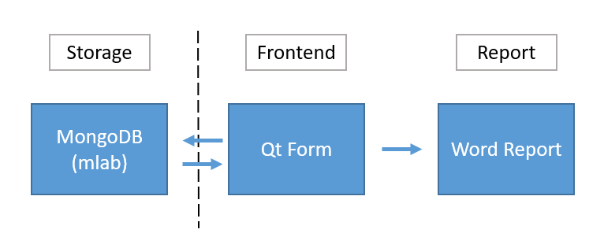

# Product Information:
Please go to our [website](https://goatwang.github.io/SimCorpFinder/index_eng.html)

# Framework


# Difficulty: 
* Crawling Efficiency: One of the most importment fiunction of this app is helping user crawling data from google search engine, and each user query may ask this app to crawl about 500 ~ 2000 websites, the crawling efficiency is very important. 
* Server Loading: Originally, I am familiar with website developing, but not Qt form in python. However, once this app deal with a user query, it takes about 5 to 10 minutes to process, and the server is not able to respond to other user during this period of time.
* Lake of Labeled Data: To avoid paying tax, the arbitrary selection of comparable companies are very general in practice. As a result, it is very difficult to find ground truth data except hiring someone to help labeling data. Even if the app can perform very well now, the lack of training data results in the bottleneck in improving its recall and precision.

# Solution: 
* Crawling Efficiency: 
    * Change requests package to asyncio and aiohttp: To async the crawling task, I use asyncio and aiohttp in substitution for requests package.
    * Multi-thread crawling: In python, multi-thread itself can be easily implemented by threading and queue packages. However, when it should be implemented with async crawling skills, the whole process can be quite complicated. And I successfully implement this task in python.  
*  Server Loading: Using windows form app.
    * In this way, the app will use local resource to crawl data from google, and the loading will be transfer to client side from server side. Thus this app was developed in Qt from interface. In the future, using frontend technique to crawl data maybe a good choice to help getting rid of Qt ugly interface.
* Lake of Labeled Data: 
    * Labeling by myself: I have modified several fininshed report as training data. However, the number of training data is still not enough to train a good recommendation model. Also, the data modified by myself is not so fair to do experiments.
    * Amazon Mturk: Use Mturk platform to hire worker to help labeling data. However, I found that the quality of labeling task was not so well on this platform. As a result, I am now still stuck in the difficulty of optimizing the recommendation result.

# berfore build this app
you should add a python file contain these code called selfpwd.py
```
def getMongoUrl():
    url = "<your_mongo_url>"
    return url
```

# build shell script
1. Prerequests
```
git checkout fileretrieval
pip install -r requirements.txt
```

2. Build
* if you want to build entire project into a directory 
```
python setup.py build
```

* if you want to build entire project as wondows installer(.msi)
```
python setup.py bdist_msi
```
